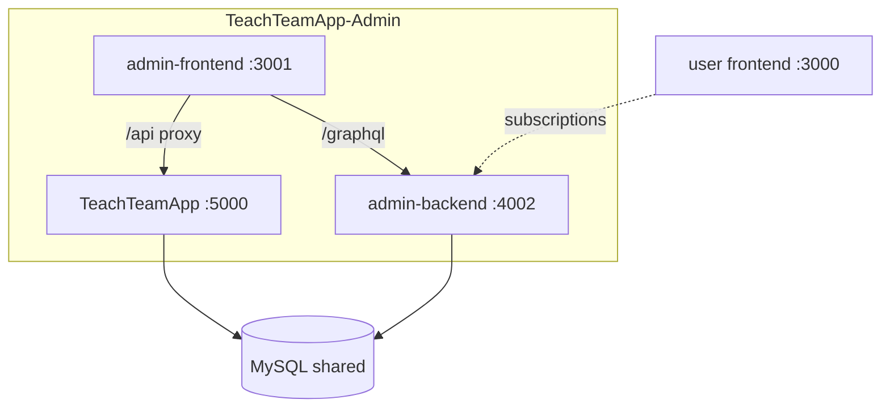
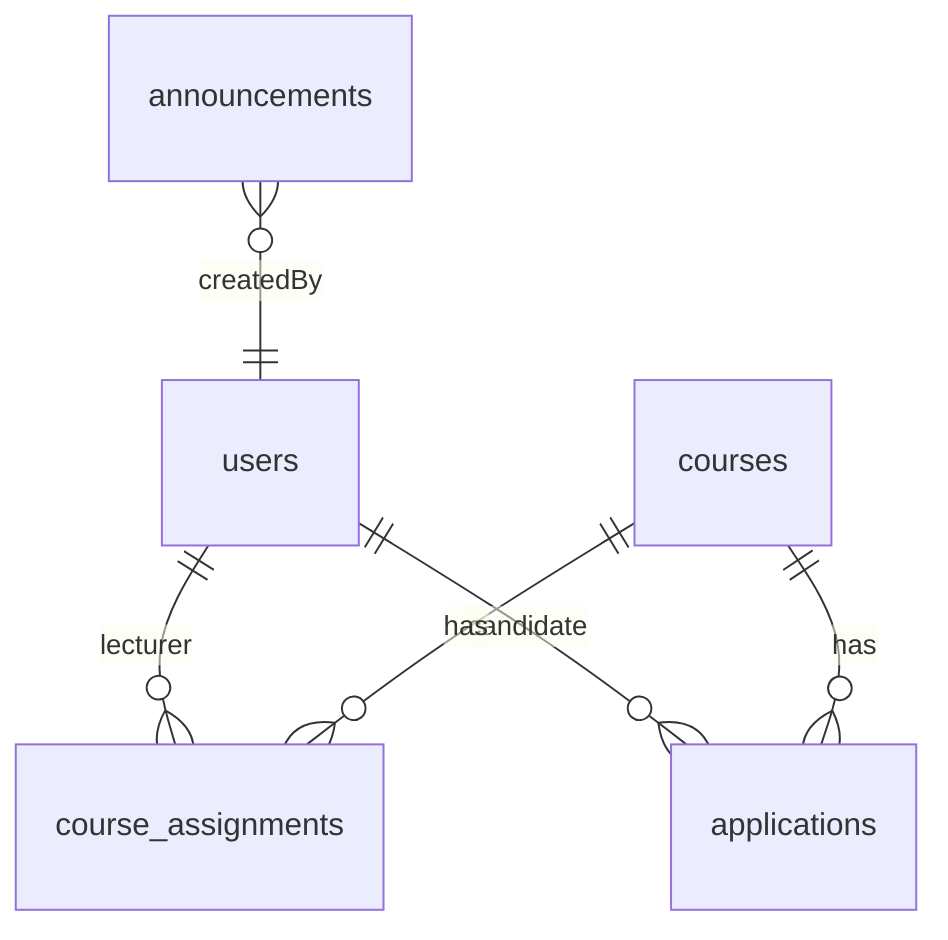

# TeachTeamApp-Admin

Separate **admin CMS** repository for the TeachTeam hiring system. Manages users, courses, announcements, and hiring reports.

**User app:** [TeachTeamApp](../TeachTeamApp/)

**Default ports:** frontend `3001`, backend `4002`

---

## Overview

| Area | Features |
|------|----------|
| Dashboard | 7 stat cards, course preview |
| Users | Create, edit, block, delete; search, filter, pagination |
| Courses | Full CRUD, assign lecturers, realtime subscriptions |
| Announcements | Full CRUD, Active/Inactive filters |
| Reports | Selected candidates, multiple selections, unselected |
| Realtime | GraphQL subscriptions (course/user/blocking events) |

---

## Tech stack

| Layer | Path | Technologies |
|-------|------|--------------|
| Frontend | `admin-frontend/` | Next.js 15, React 19, Apollo Client, Tailwind CSS 4, Recharts |
| Backend | `admin-backend/` | Express, Apollo Server 4, type-graphql, class-validator, GraphQL WS |
| Database | — | **Shared MySQL** with TeachTeamApp backend (no separate migrations) |

---

## Project structure

```
TeachTeamApp-Admin/
├── .env                 # copy from env.example (do not commit)
├── env.example
├── package.json
├── admin-frontend/      # Next.js admin UI (:3001)
│   └── src/
│       ├── app/dashboard/   # users, courses, announcements, reports
│       └── lib/graphql/     # queries & mutations
└── admin-backend/       # GraphQL API (:4002)
    └── src/
        ├── resolvers/
        ├── services/
        ├── middleware/
        └── types/
```

---

## Architecture



**Admin frontend rewrites** (`admin-frontend/next.config.js`):

| Path | Target |
|------|--------|
| `/graphql` | Admin GraphQL backend |
| `/api/*` | Main REST API |
| `/uploads/*` | Main backend static files |

**Auth:** `adminLogin` → session + JWT Bearer. All queries/mutations require admin auth (except login).

---

## Database

Admin backend reads/writes the **same 12-table schema** as the main app. Run migrations and seed from the main repo:

```bash
cd ../TeachTeamApp/backend && npm run db:reset
```



Full ERD: see [TeachTeamApp/README.md](../TeachTeamApp/README.md#database-erd).

---

## Environment variables

```bash
cp env.example .env
```

| Group | Variables |
|-------|-----------|
| Database | `DB_HOST`, `DB_PORT`, `DB_USERNAME`, `DB_PASSWORD`, `DB_NAME` — **same as main app** |
| Admin API | `ADMIN_BACKEND_PORT=4002`, `ADMIN_JWT_SECRET`, `ADMIN_SESSION_SECRET` |
| Admin UI | `ADMIN_FRONTEND_PORT=3001`, `ADMIN_FRONTEND_URL` |
| Login | `ADMIN_EMAIL`, `ADMIN_PASSWORD` |
| CORS | `ALLOWED_ORIGINS` |
| Frontend (public) | `NEXT_PUBLIC_ADMIN_GRAPHQL_ENDPOINT=/graphql`, `NEXT_PUBLIC_API_ENDPOINT=/api` |
| Rewrite targets | `MAIN_API_ORIGIN`, `ADMIN_GRAPHQL_ORIGIN` |

See [env.example](./env.example) for the full list.

---

## Getting started

**Requirements:** Node.js 20+, MySQL 8+ (schema seeded from main repo)

```bash
# 1. Seed database (from main repo)
cd ../TeachTeamApp/backend && npm run db:reset

# 2. Install admin dependencies
cd ../../TeachTeamApp-Admin
npm run install:all

# 3. Configure env
cp env.example .env

# 4. Development
npm run dev:windows    # Windows
npm run dev:unix       # macOS / Linux

# 5. Production build
npm run build
```

**Individual services:**

```bash
cd admin-backend && npm run dev    # :4002
cd admin-frontend && npm run dev:clean   # :3001
```

| Service | URL |
|---------|-----|
| Admin UI | http://localhost:3001 |
| GraphQL | http://localhost:4002/graphql |
| Health | http://localhost:4002/health |

---

## Demo accounts

| Role | URL | Email | Password |
|------|-----|-------|----------|
| **Admin** | http://localhost:3001 | `admin@admin.com` | `admin` |

After login, token is stored in `sessionStorage` (`admin-user`, `admin-token`).

**Create user (admin UI):** Users → **Create user** — candidate/lecturer emails must end with `@candidate.edu.au` or `@lecturer.edu.au`. Default security answers: Melbourne, Demo School, TeachTeam Guide, Demo.

**Cross-app test users** (seeded from main repo):

| Role | Email | Password |
|------|-------|----------|
| Lecturer | `jane.morrison@lecturer.edu.au` | `Password123!` |
| Lecturer | `marcus.chen@lecturer.edu.au` | `Password123!` |
| Lecturer | `priya.sharma@lecturer.edu.au` | `Password123!` |
| Candidate | `alex.nguyen@candidate.edu.au` | `Password123!` |
| Candidate | `samira.patel@candidate.edu.au` | `Password123!` |
| Candidate | `james.oconnor@candidate.edu.au` | `Password123!` |

---

## Admin pages

| Route | Description |
|-------|-------------|
| `/` | Admin login |
| `/dashboard` | Overview + stat cards |
| `/dashboard/users` | User management |
| `/dashboard/courses` | Course management + lecturer assignment |
| `/dashboard/announcements` | Announcement management |
| `/dashboard/reports` | Hiring reports (3 tabs, pagination) |

---

## GraphQL API

**Endpoint:** `POST http://localhost:4002/graphql`

### Auth

| Type | Name | Description |
|------|------|-------------|
| Mutation | `adminLogin(email, password)` | Returns JWT + user |
| Mutation | `adminLogout` | Clears session |

### Users

| Type | Name |
|------|------|
| Query | `getUsers(input)` — paginate, search, filter, sort |
| Query | `getUserStats`, `getUserById(id)` |
| Mutation | `createUser(input)` |
| Mutation | `updateUser(id, input)` |
| Mutation | `blockUser(id)`, `unblockUser(id)`, `deleteUser(id)` |

### Courses

| Type | Name |
|------|------|
| Query | `getCourses(input)`, `getAllCourses`, `getCourseById(id)`, `getLecturers` |
| Mutation | `createCourse`, `updateCourse`, `deleteCourse` |
| Mutation | `assignLecturerToCourse`, `removeLecturerFromCourse` |

### Announcements

| Type | Name |
|------|------|
| Query | `getAnnouncements(input)` |
| Mutation | `createAnnouncement`, `updateAnnouncement`, `deleteAnnouncement` |

### Reports

| Type | Name |
|------|------|
| Query | `getReportSummary` |
| Query | `getCourseSelectedCandidates(input)` |
| Query | `getCandidateMultipleSelections(input)` |
| Query | `getUnselectedCandidates(input)` |

### Notifications

| Type | Name |
|------|------|
| Query | `getAdminNotifications`, `getUnreadNotificationCount` |
| Mutation | `markNotificationRead`, `markAllNotificationsRead` |

### Subscriptions (WebSocket)

| Topic | Events |
|-------|--------|
| `courseUpdates` | course created / updated / deleted |
| `userAccountUpdates` | user blocked / unblocked |
| `candidateBlockingUpdates` | candidate block status |

**Validation:** `class-validator` on GraphQL input types (`CreateUserInput`, `CourseInput`, `AnnouncementInput`, …).

**Example login:**

```graphql
mutation {
  adminLogin(email: "admin@admin.com", password: "admin") {
    success
    token
    message
  }
}
```

Client operations are defined in `admin-frontend/src/lib/graphql/queries.ts`.